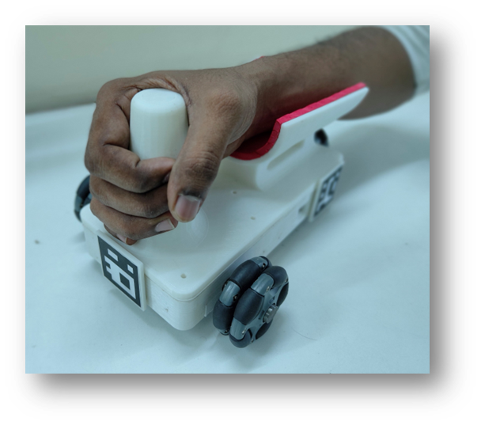

# DeepVision

Instrumented arm skateboard (ArmBo)

Stroke can often lead to motor function impairment including arm and hand. Arm skateboard is a progressive mobility device that is conventionally used for gaining back upper body strength. Although the conventionally used arm skateboard is inexpensive and easily made/procured, the lack of movement sensing prevents these devices from providing any feedback to the participants during training. This often results in boredom, and loss of interest in therapy. To address this problem, we have developed a position tracking algorithm, that combines YOLO framework and ArUco pose estimation to give real time feedback to the participants.

